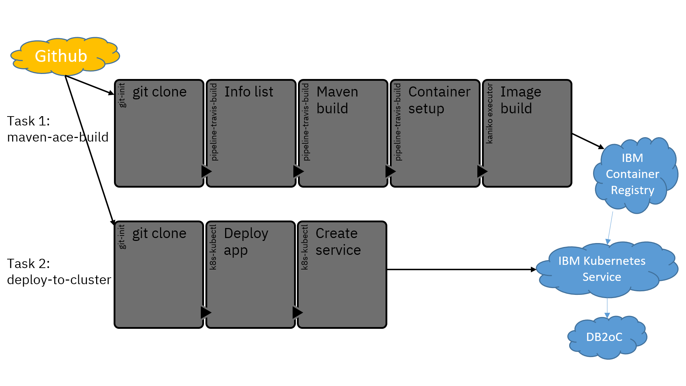

# Tekton pipeline

Used to run the pipeline stages via Tekton. Relies on the same IBM Cloud kubernetes cluster as before, with the JDBC
credentials having been set up. 




The tasks rely on several different containers:

- The Tekton git-init image to run the initial git clones.
- The pipeline-travis-build image from demo-infrastructure/docker/pipeline-travis-build in this repo. Tekton is not using TravisCI, but the image allows building Java and ACE artifacts. 
- Kaniko for building the container images.
- The ace-minimal image for a small Alpine-based runtime container (~300MB). See https://github.com/tdolby-at-uk-ibm-com/ace-docker/tree/master/experimental/ace-minimal for more details.

For the initial testing, variants of ace-minimal:11.0.0.11-alpine and pipeline-travis-build have been pushed to tdolby/experimental on DockerHub, but this is not a stable location, and the images should be rebuilt by anyone attempting to use this repo.

## Getting started

 Most of the specific registry names need to be customised: uk.icr.io may not be the right region, for example, and uk.icr.io/ace-registry is unlikely to be writable. Creating registries and so on (though essential) is beyond the scope of this document, but customisation of the artifacts in this repo will almost certainly be necessary.

 The Tekton pipeline relies on docker credentials being provided for Kaniko to use when pushing the built image, and these credentials must be associated with the service account for the pipeline. Create as follows:
```
kubectl create secret docker-registry regcred --docker-server=uk.icr.io --docker-username=iamapikey --docker-password=<your-key>
kubectl apply -f https://raw.githubusercontent.com/tdolby-at-uk-ibm-com/ace-pipeline-demo-21-02/main/tekton/service-account.yaml
```
The service account also has the ability to create services, deployments, etc, which are necessary for running the service.

Setting up the pipeline requires Tekton to be installed, tasks to be created, and the pipeline itself to be configured:
```
kubectl apply -f https://storage.googleapis.com/tekton-releases/pipeline/previous/v0.21.0/release.yaml
kubectl apply -f https://raw.githubusercontent.com/tdolby-at-uk-ibm-com/ace-pipeline-demo-21-02/main/tekton/10-maven-ace-build-task.yaml
kubectl apply -f https://raw.githubusercontent.com/tdolby-at-uk-ibm-com/ace-pipeline-demo-21-02/main/tekton/20-deploy-to-cluster-task.yaml
kubectl apply -f https://raw.githubusercontent.com/tdolby-at-uk-ibm-com/ace-pipeline-demo-21-02/main/tekton/ace-pipeline.yaml
```

Once that has been accomplished, the simplest way to run the pipeline is
```
kubectl apply -f https://raw.githubusercontent.com/tdolby-at-uk-ibm-com/ace-pipeline-demo-21-02/main/tekton/ace-pipeline-run.yaml
tkn pipelinerun logs ace-pipeline-run-1 -f
```

and this should build the projects, run the unit tests, create a docker image, and then create a deployment that runs the application.

## Possible enhancements

The pipeline should use a single git commit to ensure the two tasks are actually using the same source. Alternatively, PVCs could be used to share a workspace between the tasks, which at the moment use transient volumes to maintain state between the task steps but not between the tasks themselves.

Most of the docker images, git repo references, etc could be turned into parameters.
